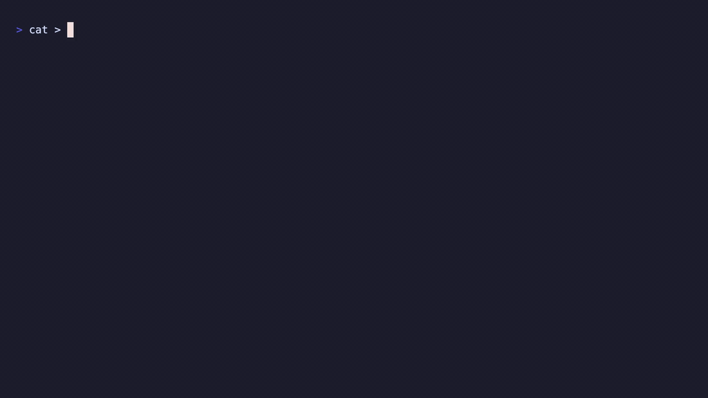

# ship

<p align="center">
  
</p>

**One word, one safely pushed commit.** Type `ship` and your change is
staged, summarised, committed and pushed, or refused with the reason. No
config, no model, no API key, nothing leaves your machine but the push. Two
machine-authored, exhaustively proved kernels decide how far the change may
travel and what its subject line may claim.

```bash
pip install git+https://github.com/devkancheti4-design/ship.git
```

```bash
ship                         # stage, summarise, commit, push, as far as the law allows
ship "why I did this"        # your words become the subject's phrase, verbatim
ship -i                      # show the ruling, then ask y/N before anything is written
ship -n                      # dry run: measure and rule, write nothing
ship https://github.com/you/repo.git   # a plain folder: create the repo, set origin, ship it
ship --eyes ollama           # let a local model write the prose instead
ship selfcheck               # re-derive both laws over all 256 inputs, in Python and in C
```

If `ship` is not found after installing (common on Windows when pip's
`Scripts` folder is not on PATH), `python -m ship` is the same command, or
`pipx install git+https://github.com/devkancheti4-design/ship.git` puts it on
PATH for you.

## Why this exists

Every AI commit tool I looked at does three things I do not want done to my
history. It sends the diff to someone else's API, so it needs a key, costs
tokens, and the diff leaves the machine. It writes a fluent message that
nobody can audit, so the same diff gets a different message on a different
day and the message can claim a fix the diff does not contain. And it never
refuses: it will stage a leaked key, write it a nice subject, and push.

`ship` is built the other way round. Nothing is inferred by anything that
cannot be audited: eight yes/no measurements become a byte, a 20-instruction
branchless kernel turns the byte into how far the change may go, and a
second byte through an 8-instruction kernel decides what the subject may
claim, with the nouns copied from the diff. Refusal is a first-class outcome,
not an error. And the two kernels come with exhaustive self-checks over all
256 inputs that you run yourself, offline, in under a second.

## Safety first

The report prints the ruling **before** the first git write, so you see what
is about to happen, and `ship -i` stops there and asks:

```
ship  byte 0x81  DIRTY FORWARD                      act PUSH
  DIRTY      1  2 paths differ from HEAD
  SECRET     0  no credential shape in added lines or staged paths
  ...
  FORWARD    1  origin/feature is an ancestor of HEAD: fast-forward
  -> will stage, commit and push. Continue? [y/N]
```

Without `-i`, `ship` acts on the ruling at once. Either way these hold:

- **A leaked secret, a conflict marker, or a bulk change writes nothing.**
  Not the index, not history, not the remote. The tree is byte-identical
  afterwards and the report names the file and the shape, never the secret.
- **`main` is never pushed.** Neither is a red test suite, a diverged
  branch, or a detached HEAD. The commit is made as a local checkpoint and
  the push is left to you. `ship` never runs `--force`, never rebases, never
  merges.
- **No commit under a message the eyes did not write.** If the summary
  cannot be produced, the change is staged and `.git/SHIP_MSG` explains.
- **Exactly the measured change is staged.** Files that appear during the
  test run are not part of the change that was ruled on.

<p align="center">
  
</p>

## Zero tokens, zero keys, 100% private

By default there is no model at all. The summary is written by measurement:
the SAY law names the kind (`feat`, `fix`, `test`, `docs`, `build`, `style`,
`revert`, or plain), and the definition names, paths and scope come straight
from the diff. Zero tokens, the same message for the same change every time,
0 to 85 ms. If you want fluent prose instead, `--eyes ollama` asks whatever
Ollama is already running on your machine, still with nothing leaving it.
The only network `ship` ever touches is your own remote: one `fetch` to
measure whether the push would fast-forward, and the push itself.

## Ultra-lightweight

| | |
|---|---|
| wheel | 38 KB |
| runtime dependencies | 0 (git and the Python standard library) |
| source | 1,913 lines including both kernels and their C self-checks |
| the two kernels | 20 and 8 machine instructions, no branches |
| a full run | 0.1 to 0.8 s wall on a small repo, test suite included |

## How it works

```
working tree ──► measure 8 bits ──► ship(byte) → act    ◄ SHIP law: how far may it travel   20 instructions, 0 branches
             ──► measure 8 bits ──► say(byte)  → kind   ◄ SAY law: what may the subject claim  8 instructions, 0 branches
             ──► render  <kind>(<scope>): <nouns>       ◄ the eyes: measurement, 0 tokens
             ──► run git exactly as far as the act says, then stop and say why
```

The act is a ladder, and the change climbs it only as far as the SHIP law rules:

| act | what happens | who can undo it |
|---|---|---|
| **3 PUSH**   | stage, commit, push | nobody: it is on the remote |
| **2 COMMIT** | stage, commit; stop before the network | `git reset --soft HEAD~1` |
| **1 STAGE**  | stage, write `.git/SHIP_MSG`; stop before history | `git reset` |
| **0 NONE**   | write nothing, not even the index | nothing to undo |

### The SHIP byte: how far

Every bit is measured, none is an opinion, and all are measured before the
first git write. What counts as a secret shape, a protected branch or a bulk
change lives in the measurement ([measure.py](src/ship/measure.py)), never in
the law.

| bit | name | tier | set when |
|---|---|---|---|
| 0 | DIRTY     | gate | the working tree differs from HEAD (modified, deleted, or untracked non-ignored files) |
| 1 | SECRET    | veto | an added line matches a credential shape (private-key header, AWS/GitHub/Slack/Google/`sk-` keys, bearer tokens, `PASSWORD = "…"`), or a staged path matches `.env*`, `*.pem`, `id_rsa*`, `*.key`, `*.p12`, `*.pfx` (`.example`/`.sample`/`.template` exempt) |
| 2 | CONFLICT  | veto | `<<<<<<<`/`>>>>>>>` markers in a changed file, unmerged paths, or MERGE_HEAD / REBASE_HEAD / CHERRY_PICK_HEAD present |
| 3 | BULK      | veto | more than 50 paths, any file over 5 MB, or an untracked binary |
| 4 | BLIND     | eyes | no usable summary: empty, subject over 72 characters, diff syntax in the text, or the eyes did not answer |
| 5 | RED       | net  | the repository's own check exists and exited non-zero (pytest, `npm test`, `cargo test`, `go test`, `make test`; auto-detected) |
| 6 | PROTECTED | net  | branch is `main`, `master`, `release/*`, or HEAD is detached |
| 7 | FORWARD   | gate | a remote exists and, after `git fetch`, the upstream is an ancestor of HEAD or does not exist yet |

**Fail closed.** Gates (DIRTY, FORWARD) are set only by a measurement that
succeeded. Hazards are set by a positive finding *and* by any measurement
that could not complete. The law never receives "unknown".

### The SAY byte: what the subject may claim

The eyes are measurement too ([mechanical.py](src/ship/mechanical.py)).
Eight facts about the change become a byte; the SAY law turns the byte into
the KIND of claim the subject line may make; the body supplies the nouns.

| bit | name | tier | set when |
|---|---|---|---|
| 0 | INVERSE   | shape   | the change's patch, reversed, is byte-identical to one of the last 20 commits |
| 1 | BLANK     | shape   | the diff has hunks, none survive `-w --ignore-blank-lines`, no untracked file has content |
| 2 | TESTSONLY | shape   | every changed path is a test (by directory or name) |
| 3 | DOCSONLY  | shape   | every changed path is documentation |
| 4 | DEPSONLY  | shape   | every changed path is a manifest, lockfile, build or CI file |
| 5 | NEWDEF    | content | a code path gained a definition whose name no removed definition had |
| 6 | GUARD     | content | a code path gained a guard (raise, throw, assert, null check, `return err`) inside a definition that existed before; moved or reindented lines do not count |
| 7 | FOCUSED   | gate    | the code paths number 1 to 3 and share one top-level directory |

| kind | subject | when |
|---|---|---|
| 0 revert | `revert: <that commit's subject>` + `This reverts commit <sha>.` | INVERSE |
| 1 style  | `style: reformat <paths>` | BLANK |
| 2 test   | `test: add <test names>` | TESTSONLY |
| 3 docs   | `docs: <verb> <paths>` | DOCSONLY |
| 4 build  | `build: <verb> <files>` | DEPSONLY |
| 5 feat   | `feat(<scope>): add <new definitions>` | NEWDEF and FOCUSED |
| 6 fix    | `fix(<scope>): guard <definitions>` | GUARD and FOCUSED |
| 7 plain  | `<verb> <paths>` or `<n> files across <m> directories` | nothing above: describe, never diagnose |

The verb follows its object: `add` only when every named path is a new
file, `remove` only when every one is deleted, `update` otherwise. A hint
on the command line replaces the phrase, never the type:
`ship "validate the discount rate"` on that same change gives
`feat(billing): validate the discount rate`. The hint is never an input to
the law: the author's words are opinion, and the law reads only
measurements. The subject is clipped to 72 characters at a word boundary,
so the SHIP law's BLIND can only fire when git itself fails.

### The laws

[`ship.c`](src/ship/ship.c) and [`say.c`](src/ship/say.c) were authored by
search and are vendored verbatim; [`law.py`](src/ship/law.py) and
[`say.py`](src/ship/say.py) carry the same lane expressions character for
character, and a test fails if they drift. Both are ladders: tiers nest, so
they are bits of one mask in tier order, and `ctz` returns the answer with
no encoding step.

```
SHIP  R1  a veto is absolute            SECRET | CONFLICT | BULK  →  NONE, whatever else is set
      R2  DIRTY gates everything        clean tree  →  NONE; never an empty commit
      R3  no history without eyes       BLIND  →  STAGE at most
      R4  no network without ff/green   RED | PROTECTED | ¬FORWARD  →  COMMIT at most
      R5  monotone                      a hazard never moves a change further; a gate never moves it back

SAY   R1  shape outranks content        an undo, a reformat, tests, docs, deps: described as that
      R2  no diagnosis without focus    feat and fix need FOCUSED; a diffuse change is plain
      R3  feat outranks fix             a new definition with a guard inside is a feature
      R4  silence is the floor          no evidence → plain; the law never invents a claim
      R5  monotone                      more evidence never yields a vaguer message
```

Both partitions were derived in closed form before synthesis and are
matched exactly: SHIP pushes on **1 input of 256** (0x81), commits on 7,
stages on 8, refuses on 240; SAY splits **128/64/32/16/8/2/1/5**. A kernel
that always refuses, or always says plain, passes every R and is rejected
by the counts. Run the proofs yourself, offline, in under a second:

```bash
ship selfcheck
```

```
SHIP law (how far the change travels), pure-Python reference over all 256 inputs:
  travelled further than allowed   0
  refused when it must not         0
  R1 veto absolute                 0
  R2 DIRTY gates everything        0
  R3 no history without eyes       0
  R4 no network without ff/green   0
  R5 monotone                      0
  partition  PUSH 1  COMMIT 7  STAGE 8  NONE 240
  counts 1/7/8/240                 exact
  the eight situations             0 violations

  TOTAL  256 inputs  0 violations

SAY law (what the subject may claim), pure-Python reference over all 256 inputs:
  said something vaguer than allowed   0
  claimed more than the evidence       0
  R1 shape outranks content           0
  R2 no diagnosis without focus       0
  R3 feat outranks fix                0
  R4 silence is the floor             0
  R5 monotone                         0
  partition 128/64/32/16/8/2/1/5
  counts 128/64/32/16/8/2/1/5         exact
  the nine situations                 0 violations

  TOTAL  256 inputs  0 violations
```

Each check runs twice: the pure-Python reference, and the vendored C
compiled with your `cc`, each against a branchy oracle that shares no
expression with the kernel. Emitted for arm64 by clang `-O2`: **ship() is
20 instructions including `ret`, say() is 8; 0 branches, 0 compares, 0
selects, 0 loads** in either. The authoring prompts are
[SHIP_LAW_PROMPT.md](SHIP_LAW_PROMPT.md) and [SAY_LAW_PROMPT.md](SAY_LAW_PROMPT.md).

### Measure only what the ruling depends on

SHIP bits are measured in cost order, and a bit is measured only while the
law's ruling still depends on it. That follows from R5: with the unmeasured
hazards assumed set and the unmeasured gates clear, the law gives a floor;
with the reverse, a ceiling; when they meet, nothing left to measure can
change the act. So a leaked key never wakes the eyes, a protected branch
never runs your test suite, and only the happy byte pays for everything.
The report names what was skipped:

```
  unmeasured    BLIND RED PROTECTED FORWARD  (the ruling did not depend on them)
```

No if-statement in the body decides where the change goes, or what it is
called. The acts do.

## Measured, not promised

All runs 2026-09-08 in scratch repositories with a bare local remote (fetch
and push are real git, not the public network), Apple Silicon Mac.
Wall-clock times are the whole `ship` invocation.

**The SAY law as eyes** (the default), one change after another on one branch:

| change | SAY byte | subject written | eyes | wall |
|---|---|---|---|---|
| guard in an existing function, new `total`, two tests | `0xE0` | `feat(billing): add total` | 48 ms | 0.68 s |
| one new test function                                 | `0x04` | `test: add test_zero_rate` | 59 ms | 0.69 s |
| reindent only                                         | `0x82` | `style: reformat billing.py` | 121 ms | 0.75 s |
| that reindent undone by hand                          | `0x83` | `revert: style: reformat billing.py` | 35 ms | 0.67 s |
| `package-lock.json` alone                             | `0x10` | `build: add package-lock.json` | 0 ms | 0.65 s |
| a comment, with the hint "note the module purpose"    | `0x80` | `note the module purpose` | 111 ms | 0.75 s |

Every subject matches the REQUIRED line for its situation in the SAY
prompt, and every message passed the SHIP law's BLIND check. The same
first change, with `--eyes ollama` and qwen2.5-coder:7b, took 7.9 s cold
and wrote "Validate discount rate and add total helper": longer, and not
wrong, but nothing in it is auditable.

**The SHIP law's situations**, run with the model as eyes earlier the same day:

| situation | SHIP byte | act | wall | what happened |
|---|---|---|---|---|
| the happy path (cold model)             | `0x81` | PUSH   | 7.9 s | staged 2, committed, pushed |
| the leaked key (`.env` with an AWS key) | `0x03` | NONE   | 0.2 s | refused; eyes, check, fetch never run; tree byte-identical; exit 2 |
| straight to `main`                      | `0x41` | COMMIT | 0.6 s | committed locally; check and fetch never run; not pushed |
| the silent model                        | `0x91` | STAGE  | 0.3 s | index holds the change, `.git/SHIP_MSG` explains; no commit |
| the diverged branch (remote 1 ahead)    | `0x01` | COMMIT | 2.0 s | committed locally; never rebased, merged or forced |

The test suite (196 tests, hermetic git, a test double for the eyes)
builds every one of these in a real repository and checks the tree, the
index, the history, the remote and the message afterwards, plus: a hook
that rejects the commit is reported (exit 3), not hidden; a file the check
creates after measurement is never staged; a dry run writes nothing; eyes
that raise are BLIND, not a crash; the same change gets the same message.

```bash
.venv/bin/python -m pytest -q
```

## Configuration (all optional)

| variable | default | meaning |
|---|---|---|
| `SHIP_EYES`          | `law` | `law`: the SAY law and measurement, 0 tokens. `ollama`: a local model writes the prose |
| `OLLAMA_HOST`        | `http://localhost:11434` | where the model lives, when asked for |
| `SHIP_MODEL`         | first model Ollama lists | which model, when asked for |
| `SHIP_CONFIRM`       | unset | `1`: always ask y/N before the first git write, as `-i` does |
| `SHIP_CHECK`         | auto-detected | the check command; `none` disables |
| `SHIP_CHECK_TIMEOUT` | 600 | seconds before a check is RED for not answering |
| `SHIP_FETCH_TIMEOUT` | 60  | seconds before a fetch clears FORWARD |

Exit codes: `0` ran as far as ruled (including "nothing to record"), `2`
refused by a veto, `3` git itself failed at commit or push (a hook, an
identity, a rejected push: the report shows git's last line), `1` not a
repository.

## What ship does not decide

- **Which files.** The change is the whole working-tree delta or nothing.
  Selecting a safe subset would be a deciding if-statement in the body.
- **The why.** A mechanical message describes what changed and never
  explains motive. Your words on the command line are the phrase,
  verbatim. Your `pre-commit` hooks still run inside `git commit`, and
  their verdict is reported, not overridden.
- **Recovery.** On a diverged branch `ship` stops; fetching, rebasing and
  forcing are yours. On a red check `ship` stops; repairing the tree is
  another law's job.

## Status

Alpha. Installed from GitHub; not on PyPI. Python
3.10+ and any git from the last several years (the test suite wants 2.28+
for `init -b`). No model, no server, no account, no key. Ollama is used
only if you ask for it.
